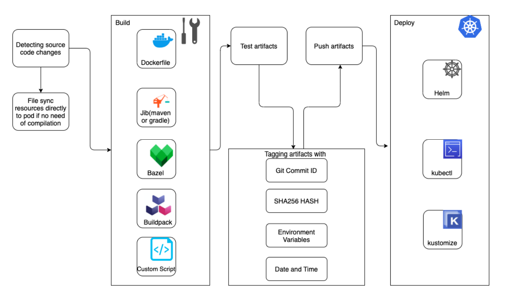

>Jib can create an image *without a Docker daemon*. This means that you don't have to install and configure Docker and create or maintain a Dockerfile.


[docker build and Jib build flow](https://www.linkedin.com/pulse/docker-image-build-vs-jib-eran-shaham/)

 

[jib 使用](https://github.com/GoogleContainerTools/jib/blob/master/jib-maven-plugin/README.md)

在 local 端可以如下執行
```bash
mvn compile jib:build -Djib.to.auth.username=${USERNAME} -Djib.to.auth.password=${PASSWORD} -Dimage=registry.hub.docker.com/cch0124/spring-tutorial-api
```
## Spring Best Practices
1. Wait for container lifecycle processes to finish

Kubernetes 再刪除一個應用程式時，過程會影響多個流程，像是 hook 關閉、註銷服務、從負載均衡器中刪除該實例等等。該過程是並行發生的，流量還是有機會路由到已開始進行關閉處理的 POD。
可以透過 `lifecycle.preStop` 配置睡眠時間，避免錯誤路由發生。一旦 `preStop` 完成，`SIGTERM` 將被發送到容器並開始正常關閉，允許任何剩餘的正在進行的請求完成。

>當 Kubernetes 向 POD 發送 `SIGTERM` 信號時，它會等待一個 termination grace period（默認為 30 秒）。如果容器時間後仍在運行，則會向它們發送 `SIGKILL` 強制刪除。如果 POD 的關閉時間超過 30 秒，這可能是增加了 `spring.lifecycle.timeout-per-shutdown-phase`，可透過在 YAML 中設置 `terminateGracePeriodSeconds` 來增加 termination grace period。

2. Add readiness and liveness probes

我們可藉由探針(probe)來知道容器內部狀態訊息。會根據定義在 yaml 中的配置，`kubelet` 會調用這些探測器並對結果做出反應。Spring boot 中 `actuator` 會從 `ApplicationAvailability` 收集`Liveness` 和 `Readiness` 訊息，分別對應這兩個指標 `LivenessStateHealthIndicator` 和 `ReadinessStateHealthIndicator`，指標會在端點 `/actuator/health` 上呈現分別是 `/actuator/health/liveness` 和 `/actuator/health/readiness`。

在 kubernetes 中可以用 `livenessProbe` 和 `readinessProbe` 來設計。

3. [Enable graceful shutdown](https://www.amitph.com/spring-boot-graceful-shutdown/)

正在執行的流程不受影響，可繼續完成已有請求的處理，但是停止接受新請求。

## API Spec
|Methods	|Urls	|Actions|
|---|---|---|
|POST	|/api/tutorials	|create new Tutorial|
|GET	|/api/tutorials	|retrieve all Tutorials|
|GET	|/api/tutorials/{id}	|retrieve a Tutorial by id|
|PUT	|/api/tutorials/{id}	|update a Tutorial by id|
|DELETE	|/api/tutorials/{id}	|delete a Tutorial by id|
|DELETE	|/api/tutorials	|delete all Tutorials|
|GET	|/api/tutorials/published|	find all published Tutorials|
|GET	|/api/tutorials?title=[keyword]|	find all Tutorials which title contains keyword|


1. /api/tutorials
```nginx
POST http://127.0.0.1:8080/api/tutorials
```
body
```json
{
    "title": "Spring boot",
    "description": "description"
}
```

DB

```sql
test=# select * from tutorials ;
                  id                  | description | published |    title
--------------------------------------+-------------+-----------+-------------
 36a49353-ee28-427c-8c44-052c63c9eb66 | description | f         | Spring boot
(1 row)
```

2. /api/tutorials/{id}

```
PUT http://127.0.0.1:8080/api/tutorials/36a49353-ee28-427c-8c44-052c63c9eb66
```

body
```json
{
    "title": "Spring boot",
    "description": "description",
    "published": true
}
```

response
```json
{
    "id": "36a49353-ee28-427c-8c44-052c63c9eb66",
    "title": "Spring boot",
    "description": "description",
    "published": true
}
```

DB
```sql
test=# select * from tutorials ;
                  id                  | description | published |    title
--------------------------------------+-------------+-----------+-------------
 36a49353-ee28-427c-8c44-052c63c9eb66 | description | t         | Spring boot
(1 row)
```

3. /api/tutorials
```
GET http://127.0.0.1:8080/api/tutorials
```

Response

```json
[
    {
        "id": "36a49353-ee28-427c-8c44-052c63c9eb66",
        "title": "Spring boot",
        "description": "description",
        "published": true
    },
    {
        "id": "b244b91a-57d5-49c5-8ad6-da59b0d483a3",
        "title": "Spring boot camel",
        "description": "camel",
        "published": false
    }
]
```

4. /api/tutorials/{id}

```
GET http://127.0.0.1:8080/api/tutorials/b244b91a-57d5-49c5-8ad6-da59b0d483a3
```

Response
```json
{
    "id": "b244b91a-57d5-49c5-8ad6-da59b0d483a3",
    "title": "Spring boot camel",
    "description": "camel",
    "published": false
}
```

5. /api/tutorials/published

```
GET /api/tutorials/published
```

Response
```json
[
    {
        "id": "36a49353-ee28-427c-8c44-052c63c9eb66",
        "title": "Spring boot",
        "description": "description",
        "published": true
    }
]
```

6. /api/tutorials?title=[keyword]

```
GET http://127.0.0.1:8080/api/tutorials?title=boot
```

Response

```json
[
    {
        "id": "36a49353-ee28-427c-8c44-052c63c9eb66",
        "title": "Spring boot",
        "description": "description",
        "published": true
    },
    {
        "id": "b244b91a-57d5-49c5-8ad6-da59b0d483a3",
        "title": "Spring boot camel",
        "description": "camel",
        "published": false
    }
]
```

7. /api/tutorials/{id}

```
DELETE http://127.0.0.1:8080/api/tutorials/36a49353-ee28-427c-8c44-052c63c9eb66
```

Respones

code 204 No content

DB

```sql
test=# select * from tutorials ;
                  id                  | description | published |       title
--------------------------------------+-------------+-----------+-------------------
 b244b91a-57d5-49c5-8ad6-da59b0d483a3 | camel       | f         | Spring boot camel
(1 row)
```

8. /api/tutorials

```
DELETE http://127.0.0.1:8080/api/tutorials
```

Respones

code 204 No content

DB

```sql
test=# select * from tutorials ;
 id | description | published | title
----+-------------+-----------+-------
(0 rows)
```

## PostgreSQL on K8s
1. NFS Server
從 WSL 安裝，請勿在 `/mnt/{c、d}` 進行掛載，因為硬碟格式非 ext4，每個節點安裝 `apt-get install nfs-common`
```bash=
docker run --name nfs-server -itd --privileged --restart unless-stopped -e READ_ONLY -e SHARED_DIRECTORY=/data -v $PWD/dynamic:/data -p 2049:2049 itsthenetwork/nfs-server-alpine:12
```

>第一個方法未成功

2. 建立一台 nfs-server 虛擬機
或是建立一台 nfs-server，按照此檔案的 [script](infra/nfs/Vagrantfile) 運行即可。並在每個節點安裝
```bash
sudo apt-get install nfs-common -y
```

最後 `apply` [檔案](/k8s/nfs-storage)，`api-server` 需添加 `- --feature-gates=RemoveSelfLink=false` 參數，才可運行，可參考此[討論](https://github.com/kubernetes-sigs/nfs-subdir-external-provisioner/issues/25)，kubernetes 1.24 版後不適用此安裝方式。


3. 推薦 NFS 安裝
[artifacthub.io nfs-subdir-external-provisioner](https://artifacthub.io/packages/helm/nfs-subdir-external-provisioner/nfs-subdir-external-provisioner)
```bash
helm repo add nfs-subdir-external-provisioner https://kubernetes-sigs.github.io/nfs-subdir-external-provisioner/
helm install nfs-subdir-external-provisioner nfs-subdir-external-provisioner/nfs-subdir-external-provisioner \
    --set nfs.server=192.168.133.135 \
    --set nfs.path=/mnt/nfs_share \
    --set storageClass.name=managed-nfs-storage \
    --set storageClass.provisionerName=cch.com/nfs \
    --set storageClass.archiveOnDelete=false \
    --version 4.0.15 \
    -n nfs-provisioner \
    --create-namespace
```


postgresql 使用 `kubegres` 方案，進行佈署，其相關資訊可參考此[鏈結](https://www.kubegres.io/doc/getting-started.html)，相關配置[yaml](/k8s/pg)

## Skaffold Architecture

## [Kube-context Activation](https://skaffold.dev/docs/environment/kube-context/) And [Profiles](https://skaffold.dev/docs/environment/profiles/)
當要與 Kubernetes 集群交互時，需要配置 `kube-context`。透過 `kube-context` 選擇 Kubernetes 集群、Kubernetes 用戶和預設 namespace。預設下，Skaffold 使用 `kube-config` 文件中的當前 `kube-context`。

本實驗環境是 WSL2 存取虛擬機中的集群。WSL2 安裝 `kubectl`，並依照以下方式做即可操控遠方群集，但通常不應該使用 kubernetes 的 admin 來做。

```bash
$ vagrant ssh master-skaffold
# 複製 .kube/config 至 WSL 的 .kube 下
$ KUBECONFIG=skaffold:~/.kube/skaffold kubectl config view # 這邊是貼至 .kube/skaffold 檔案中
apiVersion: v1
clusters:
- cluster:
    certificate-authority-data: DATA+OMITTED
    server: https://192.168.56.30:6443
  name: kubernetes
contexts:
- context:
    cluster: kubernetes
    user: kubernetes-admin
  name: kubernetes-admin@kubernetes
current-context: kubernetes-admin@kubernetes
kind: Config
preferences: {}
users:
- name: kubernetes-admin
  user:
    client-certificate-data: REDACTED
    client-key-data: REDACTED
$ KUBECONFIG=~/.kube/skaffold:~/.kube/config kubectl config view --flatten > config # 透過 --flatten 可顯示完整資訊，並將其合併至 config 檔案
$ kubectl config  get-contexts # 會看到我新增的群集
CURRENT   NAME                          CLUSTER      AUTHINFO           NAMESPACE
*         kubernetes-admin@kubernetes   kubernetes   kubernetes-admin
$ kubectl get node -o wide # WSL 就可以控制遠端(VM)的群集了
NAME              STATUS   ROLES                  AGE   VERSION   INTERNAL-IP     EXTERNAL-IP   OS-IMAGE             KERNEL-VERSION      CONTAINER-RUNTIME
master-skaffold   Ready    control-plane,master   14h   v1.23.0   192.168.56.30   <none>        Ubuntu 20.04.4 LTS   5.4.0-107-generic   cri-o://1.23.2
node1-skaffold    Ready    <none>                 14h   v1.23.0   192.168.56.31   <none>        Ubuntu 20.04.4 LTS   5.4.0-107-generic   cri-o://1.23.2
node2-skaffold    Ready    <none>                 14h   v1.23.0   192.168.56.32   <none>        Ubuntu 20.04.4 LTS   5.4.0-107-generic   cri-o://1.23.2
$ kubectl config  get-contexts -o name # 獲取當前 context 名字，這將運用在 skaffold 的 kubeContext 字段
kubernetes-admin@kubernetes
```

為了讓在本地開發的專案能夠佈署在遠端集群上我們定義了以下資訊，當然這段可以用 `skaffold dev --kube-context <myrepo>` 取代。下面配置目的是為了，設置部署到不同的 Kubernetes 上下文中。

```yaml
...
profiles:
- name: dev-cluster
  activation:
  - env: ENV=dev # 當此變數存在則觸發此 profile
  - kubeContext: kubernetes-admin@kubernetes
    command: dev
```

對於 Skaffold 配置檔來說，`kube-context` 有雙重作用
- Skaffold 配置檔可以由字段 `profiles.activation.kubeContext` 中 `kube-context` 自動存取
- Skaffold 配置檔可能由字段 `profiles.deploy.kubeContext` 中 `kube-context` 存取
  
>無法更改正在運行的 skaffold dev 的 kube-context。要更改，需要重新運行 skaffold dev

Skaffold 配置檔可為不同的 Kubernetes 上下文定義 build、test 和 deploy。不同的上下文通常不同環境，例如 prod 或 dev。為此須透過 `profiles` 字段進行定義，其有六個部分
- name: profile 名稱
- build
- test
- deploy
- patches
- activation

profiles 中定義的內容是可以覆蓋外部定義的內容。

當定義好之後我們可以如下運行
```bash
$ skaffold dev -p dev-cluster
```

接著透過起一個有 `curl` 指令的容器，針對該 API 服務的 `service` 資源進行存取，並得到以下結果
```bash
kubectl run mycurlpod --image=curlimages/curl -i --tty -- sh
/ $ curl http://tutorial-api-service.default.svc.cluster.local:8080/hello
Hello Skaffold! From host: tutorial-api-85446658dd-8pvzr/10.0.2.197
```

## Skaffold features
- Easy to share 
```shell
# install skaffold
git clone repository URL
skaffold dev
```
- Integrated with IDE
- File sync 
  - 將更改的檔案直接複製到已經運行的容器中，以避免重新構建、重新部署和重新啟動容器
- Super-fast local development
  - 可判別 Kubernetes context 是否設置為本地 Kubernetes 集群，避免將 image 推送到遠程容器倉庫。因此，可以減少網路延遲。
  - 能即時檢測更改，並自動執行構建、推送和部署工作流程。這可以加速內部開發循環，還可以提高工作效率。
- Effortless remote development
  - Skaffold 不僅能夠提升內部開發效率，也可創建完整的 CI/CD 流程
- Built-in image tag management
  - 原因是 Skaffold 會在每次重建 Image 時自動生成 image tag。這樣不必手動編輯 Kubernetes 佈署檔案。Skaffold 的默認標記策略是 `gitCommit`。
```yaml
spec:
  containers:
  - image: cch0124/spring-tutorial-api:{imageTag}
    name: tutorial-api
```
- Lightweight
  - CLI 工具，輕巧、易使用
- Pluggable architecture
  - Skaffold 具有可插拔的架構。可以挑選構建和部署工具，Skaffold 會相應調整。
- Purpose-built for CI/CD pipelines
  - Skaffold 可以建立有效的 CI/CD
  - 使用 `skaffold run` 執行端到端管道或使用單獨的命令(skaffold build 或 skaffold deploy)
  - 使用 `skaffold render` 和 `skaffold apply` 等命令，可以使應用程序創建 *GitOps 風格*的持續交付工作
- Effortless environment management
  - Skaffold 可以針對不同環境定義 build、test或deploy配置檔
  - Skaffold profiles 參數可以幫助我們實現
### Skaffold profile patches

```yaml
build:
  artifacts:
    - image: docker.io/hiashish/skaffold-example
      docker:
        dockerfile: Dockerfile
    - image: docker.io/hiashish/skaffold2
    - image: docker.io/hiashish/skaffold3
deploy:
  kubectl:
    manifests:
      - k8s-pod
profiles:
  - name: dev
    patches:
      - op: replace 
        path: /build/artifacts/0/docker/dockerfile
        value: Dockerfile_dev
```
上述範例 Skaffold 將用於構建第一個 docker.io/hiashish/skaffold-example 映像的 Dockerfile 替換為名為 Dockerfile_dev 的不同 Dockerfile。

`patches` 部分的操作字串(op)指定了該補丁要執行的操作。其選項有
- add 
- remove 
- replace 
- move
- copy 
- test
### Skaffold profile activation
下面新增一個名為 docker 的 `profiles`。這邊是使用地端 docker 進行 Image 的打包流程，並將其推倒倉庫。
```yaml
...
profiles:
  - name: dev-cluster
    activation:
      - env: ENV=dev
      - kubeContext: kubernetes-admin@kubernetes
        command: dev
  - name: docker
    build:
      tagPolicy:
        customTemplate:
          template: "{{.FOO}}_{{.BAR}}-docker"
          components:
            - name: FOO
              dateTime:
                format: "2006-01-02"
                timezone: "UTC"
            - name: BAR
              gitCommit:
                variant: AbbrevCommitSha
      artifacts:
        - image: spring-tutorial-api
          context: .
          docker:
            dockerfile: Dockerfile
            cacheFrom:
              - spring-tutorial-api
      local:
        push: true
        useDockerCLI: false
        useBuildkit: false
```

透過 --profile 或 -p 參數運行 `skaffold run` 或 `skaffold dev` 命令時，將激活此配置文件。

```shell
skaffold --default-repo docker.io/cch0124 run -p docker
```

沒有在 `profiles` 這個  docker 下指定部署部分。表示 Skaffold 將繼續使用 `deploy` 關鍵字下的 kubectl 進行部署。如果需要多個 `profiles`，可以使用 `-p` 參數並使用逗號分隔的配置文件，如下

```shell
skaffold dev -p profile1,profile2
```

`activation` 是另一種方法是使用 `skaffold.yaml` 當中的物件根據以下內容自動觸發配置文件
- kubeContext
- env An environment variable: env
- command A Skaffold command

下面有一個 dev-cluster 的 profiles 配置內容
```yaml
...
profiles:
- name: dev-cluster
  activation:
  - env: ENV=dev
  - kubeContext: kubernetes-admin@kubernetes
    command: dev
```

如果 `env` 環境變數的值匹配 `dev` 則會自動匹配該配置(dev-cluster)。也因為該配置這邊沒有特別定義 build、test 和 deploy 步驟，所以會引用主配置部分。除此之外，如果滿足以下條件，將自動觸發配置(dev-cluster)。
- ENV 是 dev
- kubeContext 是 kubernetes-admin@kubernetes
- command 是 skaffold run

在 skaffold.yaml 中我們預設使用 kubectl 進行佈署。當然這些可以根據不同環境使用不同方式佈署，像是開發使用 kubectl，在生產使用 Helm。

Skaffold 默認下會從 `${HOME}/.kube/` 路徑中的 kube 配置檔案中查找當前的 Kubernetes *context*。要變動他可以如下
```shell
skaffold dev --kube-context <myrepo>
```
抑或者在 skaffold.yaml 中使用 `kubeContext` 指定。而 CLI 的優先權會最高。

## A local Kubernetes cluster
如果 Kubernetes context 設置為地端 Kubernetes 集群，則無需將 images 推送到飛地端 Kubernetes 集群。相反，Skaffold 會將 image 讓本地 Docker daemon 觸發以加快開發週期。
地端開發 Kubernetes 集群方式有以下
- Docker Desktop
- Minikube
- Kind
- k3d
- etc.
## Demystifying Skaffold's architecture
Skaffold 的設計考慮了可插拔性，它將系統細分為的更小部分可以想成是一個模組，該模組可以獨立創建、修改、替換或與其他模組或不同系統之間交換，其架構如下



對於 skaffold 整體模組可以如下細分
- Container image builders
  - Dockerfile
  - Jib
  - Bazel
  - Cloud-Native Buildpacks
  - Custom Script
- Container testing tools/strategy
  - Custom tests
  - Container structure tests
- Container image taggers 
- Container deployment tools
  - Helm
  - kubectl
  - kustomize

Skaffold 對於 Image 的 tag 管理，當前支援以下
- The gitCommit tagger
- The inputDigest tagger
- The envTemplate tagger
- The datetime tagger
- The customTemplate tagger
- The sha256 tagger

當前範例流程

Detecting source code changes -> Jib -> Tagging artifacts -> kubectl

也許生產環境中，使用 Jib 插件來構建 Image、測試、將其推送到 registry，最後使用 Helm 將其部署到遠程 Kubernetes 集群。

## Skaffold workflow

通常，Skaffold 以兩種模式工作，*持續開發*或透過 `skaffold dev` 和 `skaffold run` 等命令的端到端開發。以 `skaffold dev` 來說會是像這樣
1. 接收並監看源碼以進行更改
2. 如果用戶將更改的文件標記為可以復制，則直接複製更改的文件以進行 `build`
3. 從源碼建構 Image(產物)
4. 使用 container-structure-tests 或自定義腳本測試建構的產物
5. 將產物打上 tag
6. 推送產物，如果為非本地的集群
7. 用新的 tag 更新 Kubernetes 佈署檔案
8. 佈署產物
9. 使用內置的檢查，監控已部署的物件
10. 從正在運行的 pod 觀察 log
11. 按 Ctrl + C 在退出時清理所有已部署的物件

而 `skaffold run` 類似，但還是有以下的不同
- Skaffold 不會持續監看程式碼更改
- 預設下，Skaffold 不會從正在運行的 pod 在控制台顯示 log
- 不會進行佈署物件的清理

對於持續開發就是(skaffold dev)
```
watch for changes -> Build artifacts -> Test artifacts -> Tag image -> Push image -> Update manifests -> Deploy -> Stream logs -> Cleanup
```
對於 end-to-end 開發(skaffold run)
```
Build artifacts -> Test artifacts -> Tag image -> Push image -> Update manifests -> Deploy
```

## Skaffold configuration
Skaffold 需要執行的任何操作都應在 skaffold.yaml 中明確定義。像是要用什麼來建構 Image，要用什麼方式佈署到哪個集群。`Skaffold` 預設當前目錄中找到配置文件檔案為 `skaffold.yaml`，但是，我們可以用 `--filename` 覆蓋該位置。`skaffold.yaml` 有以下主要元件

| Component                                                        | Description                         |
|------------------------------------------------------------------|-------------------------------------|
| apiVersion                                                       | 定義 Skaffold API 版本                  |
| Kind                                                             | 值為 `Config`                         |
| Metadata                                                         | 包含有關配置的其它屬性，像是 `name`               |
| [Build](https://skaffold.dev/docs/references/yaml/#build)        | 描述如何構建 Image，並可定義 tag 和 push 流程     |
| [Test](https://skaffold.dev/docs/references/yaml/#test)          | 如何測試 `Image`                        |
| [Deploy](https://skaffold.dev/docs/references/yaml/#deploy)      | 如何佈署 `Image`，像是 `helm`、`kubectl` 等  |
| [Profiles](https://skaffold.dev/docs/references/yaml/#profiles)  | 可以覆蓋用於 `build`、`test` 或 `deploy` 配置 |
| Requires                                                         | 要導入當前配置的其他 `Skaffold` 配置列表          |

Skaffold 也支援持全局配置檔案，該檔案位於 `~/.skaffold/` 配置路徑中。支援的選項可參考[官方](https://skaffold.dev/docs/design/global-config/)，可以在全局級別定義
```shell
$ skaffold config
Interact with the global Skaffold config file (defaults to `$HOME/.skaffold/config`)

Available Commands:
  list        List all values set in the global Skaffold config
  set         Set a value in the global Skaffold config
  unset       Unset a value in the global Skaffold config

Use "skaffold <command> --help" for more information about a given command.
cch@Itachi:~$ ls .skaffold/config
.skaffold/config
$ cat .skaffold/config
global:
  survey:
    last-prompted: "2022-08-06T11:16:52+08:00"
  collect-metrics: true
  update:
    last-prompted: "2022-08-06T20:37:09+08:00"
kubeContexts: []
```

## Understanding common CLI commands
透過 CLI 我們可以完成 CI/CD 流程

- **Commands for end-to-end pipelines**
  - **skaffold run** 允許一次建置(build) 和佈署(deploy)
  - **skaffold dev** 允許觸發構建(build)和部署(dev)的持續開發循環，此工作流程將在退出時清理
  - **skaffold debug** 允許您觸發持續開發循環並在調試模式下構建(build)和部署(deploy)管道，此工作流程也將在退出時清理
- **Commands for CI/CD pipelines**
  - **skaffold build** 構建、標記和推送 Image
  - **skaffold test** 針對已構建的應用程式 Image 運行測試
  - **skaffold deploy** 對更新的 image 進行佈署
  - **skaffold delete** 針對佈署的物件進行資源清除
  - **skaffold render** 允許構建應用程式 Image，然後將帶有新構建的 tag 合成 Kubernetes 清單導出到檔案或終端
  - **skaffold apply** 將模板化的 Kubernetes 清單作為輸入，並在目標集群上創建資源
- **Commands for getting started**
  - **skaffod init** 初始化
  - **skaffold fix** 更新版本
- **Miscellaneous commands**
  - **skaffold help** 
  - **skaffold version**
  - **skaffold completion**
  - **skaffold config** 管理 skaffold context 參數
  - **skaffold credits**
  - **skaffold diagnose** 針對當前 skaffold 的配置
  - **skaffold schema** 打印用於驗證 skaffold.yaml 配置的 JSON 模式
## Skaffold pipeline stages

Skaffold 流水線階段(pipeline stage)可大致分為以下幾個領域：
- Init
- Build
- Tag
- Test
- Deploy
- File
- Log tailing
- Port forwarding
- Cleanup
### Init stage
通常會建置一個基本的 Skaffold 配置檔(skaffold init)。*Skaffold 在專案目錄中會查找任何構建配置檔案，例如 Dockerfile、build.gradle 和 pom.xml，然後自動生成構建和部署配置*。如果 Skaffold 檢測到多個構建配置檔案，它會提示將構建配置檔案與部署配置中檢測到的任何 Images 配對，並讓用戶端選擇。也可以使用 `skaffold init` 命令傳遞 `--generate-manifests` 來生成清單內容。

### Build stage
Skaffold 支援各種不同建置 Images 的工具。
- Jib
- Cloud Native Buiildpacks
- etc.
在集群中，構建由 `kaniko` 或使用自定義腳本(custom script)。僅 Dockerfile、Jib 和使用 Cloud Build 的 Buildpack 支持遠程構建。對於本地構建，基本上都可以用

透過 skaffold.yaml 文件的構建部分設置構建配置。下面是一個例子

```yaml
build:
  tagPolicy:
    sha256: {}
  artifacts:
  - image: cch0124/spring-tutorial-api
    custom:
      buildCommand: mvn compile jib:build -Djib.to.auth.username=$USERNAME -Djib.to.auth.password=$PASSWORD -Dimage=$IMAGE
      dependencies:
        paths:
        - src/**
```
### Tag stage
Skaffold 可以透過以下 images tag 策略：
- 透過 `gitCommit` 進行 tag，該利用 Git 提交來 tag images
- 透過 sha256 進行 tag，使用最新標記來 tag images
- 透過 envTemplate 進行 tag，使用環境變數來 tag images
- 透過 dateTime 進行 tag，接受具有可配置模式的當前日期和時間
- 透過 customTemplate 進行 tag

使用 `skaffold.yaml` 的 `build` 中的 `tagPolicy` 字段配置 tag 策略。如果未指定 `tagPolicy`，則默認為 `gitCommit` 策略。
```yaml
#customTemplate 範例
  build:
    tagPolicy:
      customTemplate:
        template: "{{.FOO}}_{{.BAR}}-docker"
        components:
          - name: FOO
            dateTime:
              format: "2006-01-02"
              timezone: "UTC"
          - name: BAR
            gitCommit:
              variant: AbbrevCommitSha

```

### Test stage

#### Container structure test
Skaffold 支援在建構 images 上執行[容器結構測試](https://github.com/GoogleContainerTools/container-structure-test)。器結構測試(Container Structure Test)主要是為了驗證容器的*內容*和*結構*。例如，可能想在容器中運行一些指令來測試它是否成功執行。構建物件(building the artifact)後，Skaffold 將在 images 上運行相關的結構測試，*如果測試失敗，Skaffold 將不會往下部署*。

#### Custom test
透過 Skaffold 自定義測試，可以自定義驗證流程作為其開發循環的一部分，並且會在佈署之前執行。也可以使用 `--skip-tests` 選擇不運行自定義測試，也可以使用 `skaffold test` 單獨運行測試。
我們可以如下定義流程
- unit tests
- GCP Container Analysis 、Anchore Grype 對 images 運行驗證和安全掃描
- 驗證 Kubernetes yaml 驗證 [kubeval](https://github.com/instrumenta/kubeval) 或 [kubeconform](https://github.com/yannh/kubeconform)
- 使用 Helm charts 可以用 `helm lint` 驗證

定義一個 name 為 test 的 `profiles`
```yaml
- name: test
  test:
    - image: docker.io/cch0124/spring-tutorial-api
      custom:
        - command: mvn test -Dmaven.test.skip=false
```

接著運行 `skaffold dev --profile=test`

#### Deploy stage
Skaffold 部署階段通常將 Kubernetes 佈署 yaml 中 images 的 tag 名稱替換為最終 tag 的 images 名稱來呈現 Kubernetes 要佈署資源，甚至可能透過擴展 `helm template` 或 `kustomize` 覆蓋資源。`Skaffold` 在內部使用 `kubectl rollout status` 來驗證部署的狀態。

Skaffold 目前支援以下工具將應用程式部署到本地或遠程 Kubernetes 集群：
- kubectl
- helm
- kustomize
以 `kubectl` 為例，我們在 `deploy` 字段設置部署配置，

```yaml
deploy:
  kubectl:
    manifests:
    - k8s/deploy-native/tutorial/application-properties-cm.yaml
    - k8s/deploy-native/tutorial/deployment.yaml
    - k8s/deploy-native/tutorial/globalenv-cm.yaml
    - k8s/deploy-native/tutorial/globalenv-secret.yaml
    - k8s/deploy-native/tutorial/ingress.yaml
    - k8s/deploy-native/tutorial/service.yaml
```


## File sync
Skaffold 有一個很棒的功能，可以將更改的檔案複製到已部署的容器中，而*無需重新構建、重新部署和重新啟動相應的 pod*。

我們可以透過向 `skaffold.yaml` 檔案中的物件產物(artifact)添加帶有同步規則的同步(sync)部分來啟用此檔案複製功能。在內部，Skaffold 創建一個 `.tar` 檔案，其中包含與我們在 `skaffold.yaml` 檔案中定義的同步規則匹配的更改檔案。然後，這個 `.tar` 檔案被傳輸到相應的容器中並在其中提取。

Skaffold 支持以下類型的同步
- **manual** 需要從運行容器的本地和目標路徑中指定來源檔案路徑
- **infer** Skaffold 將查看 Dockerfile 來推斷目標路徑。在同步規則下，可以指定哪些檔案符合同步條件
- **auto** Skaffold 將自動把已知檔案類型生成同步規則

Jib 與 Skaffold 的集成允許在進行更改後將 class 檔案、資源檔案和 Jib 的額外目錄文件自動同步到遠程容器。必須在編譯/實現範圍內包含 spring-boot-devtools 依賴項，這與官方文檔中概述的配置相反。對於 jib 他會不知道構建中的任何特殊 spring 配置，建議使用配置文件來打開或關閉 jib 容器構建中的 devtools 支援。

定義一個 `profiles`，並且 sync 設為 auto。

```yaml
- name: sync
  build:
    artifacts:
      - image: docker.io/cch0124/spring-tutorial-api
        context: .
        jib:
          type: maven
          args:
          - -Psync
        sync:
          auto: true
```


### Log tailing 
Skaffold 可以追蹤由它構建和部署的容器日誌。使用此功能可以在執行 `skaffold dev`、`skaffold debug` 或 `skaffold run` 時將 Log 從集群追蹤到本地開發機器上。

對於 `skaffold dev`、`skaffold debug` Log 功能是預設啟用。否則需要使用 `-tail` 進行參數配置


### Port forwarding
Skaffold 在開發(dev)、調試(debug)、部署(deploy)或運行(run)模式下支援服務的自動端口轉發和用戶定義的端口轉發。可以不必公開端點來存取應用程式，端口轉發有助於本地開發。Skaffold 在內部使用 `kubectl port-forward` 來實現端口轉發，因此可以*在 `skaffold.yaml` 中明確定義自定義端口轉發*，或者在運行 skaffold dev、debug、run 或 deploy 時傳遞 `--port-forward` 參數。架構如下圖所示

 From skaffold 官方

我們可以如下定義，同樣我們使用一個 `profiles`

```yaml
- name: userDefinedPortForward
  portForward:
    - localPort: 9090
      port: 8080
      namespace: default
      resourceName: tutorial-api-service
      resourceType: service
```

### Cleanup

使用 `skaffold run` 和 `skaffold dev`，可以在 Kubernetes 集群中創建資源，創建儲存在上的 images，有時還可以將 images 推送到其倉庫(registry)。

Skaffold 提供了清除資源功能和其中一些副作用
- 執行 `skaffold delete` 或是透過 `Ctrl+C`
- 可以通過傳遞 `--no-prune=false` 為本地 `Docker daemon images` 啟用 image 修剪，由於預設情況下啟用了產物緩存(artifact caching )，因此需要禁用它才能使清除工作。實際要運行的指令是 `skaffold dev --no-prune=false --cache-artifacts=false`，透過按 `Ctrl + C` 進行 `skaffold dev` 和 `skaffold debug`，`Skaffold` 將自動清理儲存在本地 Docker daemon 上的 images。
- 對於已推送到遠程容器倉庫的 images，用戶必須負責清理

以下面 `profiles` 為 `docker` 的設定來說，我們使用地端的 docker 服務進行建置

```yaml
- name: docker
  build:
    tagPolicy:
      customTemplate:
        template: "{{.FOO}}_{{.BAR}}-docker"
        components:
          - name: FOO
            dateTime:
              format: "2006-01-02"
              timezone: "UTC"
          - name: BAR
            gitCommit:
              variant: AbbrevCommitSha
    artifacts:
      - image: spring-tutorial-api
        context: .
        docker:
          dockerfile: Dockerfile
          cacheFrom:
            - spring-tutorial-api
    local:
      push: true
      useDockerCLI: false
      useBuildkit: false
```

透過運行 `skaffold dev --no-prune=false --cache artifacts=false` 。在構建和部署之後，可以按 `Ctrl + C`，這應該會修剪 images 並刪除任何 Kubernetes 資源。


## Debugging with Skaffold
透過 `skaffold debug` 我們可以調試應用程式。Skaffold 為不同容器的 runtime 技術提供調試。一旦啟用調試，相關的調試端口就會暴露出來並標記為端口轉發到本地機器。

但是，在調試模式下，`skaffold debug` 將禁用 images 重建和同步(sync)，因為如果保存檔案更改，它可能會導致調試意外終止，但還是可以使用 `--auto-build`、`--auto-deploy` 和 `--auto-sync` 參數允許 images 重建和同步。

##  Working with Skaffold container image builders
### Dockerfile 
這些年來，Docker 一直是創建容器的首要標準。Docker 架構依賴於一個守護(daemon)行程，該行程必須運行才能為所有 Docker 指令(push、pull、run ...等)提供服務。我們可以借助 Dockerfile 製作應用程式的容器 images 時進行可以自定義其運行環境內容。

```
Java Source Code ---Create Jar---> Dockerfile ---docker build---> Docker images--- docker run ---> container
```

可以參考本[範例](Dockerfile)

### Jib
[Jib](https://github.com/GoogleContainerTools/jib) 代表 Java Image Builder，完全用 Java 編寫。但是，它考藉由 CLI 工具，可用於 `Node.js` 上的 `Python` 等非 Java 應用程序。

*使用 Jib 的顯著優勢是無需了解有關安裝 `Docker` 或維護 `Dockerfile` 的任何訊息*。Jib 是無守護進程(daemonless)的。對為 Java 開發人員，只關心最後可執行產物（jar 檔案），而使用 Jib 我們不必處理任何 Docker 相關操作。

對於本專案來說我們透過 maven 引入 Jib 插件並透過一些配置來將我們應用程式容器化。其流程大致如下

```
Project --- Jib ---> Container Image Registry
```

同樣新增一個 `profiles` 名為 jib，其如下定義

```yaml
- name: jib
  build:
    tagPolicy:
      customTemplate:
        template: "{{.SHA}}-jib"
        components:
          - name: SHA
            gitCommit:
              variant: AbbrevCommitSha
    artifacts:
      - image: docker.io/cch0124/spring-tutorial-api
        context: .
        jib:
          type: maven
          fromImage: adoptopenjdk:16-jre # base image
          project: cch.com.example:skaffold
          args:
            - -DskipTests
```

最後透過 `skaffold build -p jib` 驗證

Jib 巧妙將應用程式映像層拆分為以下幾層，以加快重建速度：
- Classes
- Resources
- Project Dependencies
- Snapshot and all other dependencies
目標是將經常更改的檔案與少更改的檔案分開，直接的好處是不必重建整個應用程式，因為 Jib 只重建包含已更改檔案的層，並為未更改的檔案重用緩存層。
使用 Jib，如果不指定 images digest，可能會看到以下警告：
```shell
[INFO] --- jib-maven-plugin:3.2.1:build (default-cli) @ skaffold ---
[WARNING] 'mainClass' configured in 'maven-jar-plugin' is not a valid Java class: ${start-class}
[INFO] 
[INFO] Containerizing application to cch0124/spring-tutorial-api:9030de8-dirty-jib...
[WARNING] Base image 'adoptopenjdk:16-jre' does not use a specific image digest - build may not be reproducible # this
[INFO] Getting manifest for base image adoptopenjdk:16-jre...
[INFO] Building dependencies layer...
[INFO] Building resources layer...
[INFO] Building classes layer...
[INFO] Building jvm arg files layer...
```

我們可以如下更改
```xml
<plugin>
				<groupId>com.google.cloud.tools</groupId>
				<artifactId>jib-maven-plugin</artifactId>
				<version>3.2.1</version>
				<configuration>
					<from>
						<image>openjdk:16-jdk-alpine@sha256:b40f81a9f7e7e4533ed0c6ac794ded9f653807f757e2b8b4e1fe729b6065f7f5</image>
					</from>
					...
				</configuration>
			</plugin>
```

### Custom script
如果沒有建構 images 的支援，可以使用自定義腳本選項。此選項，可以編寫自定義腳本或選擇喜歡的構建工具，可以透過向 skaffold.yaml 文件的構建部分中的每個 `artifacts` 添加自定義字段來配置自定義腳本。

以下面為例，使用 `custom` 字段

```yaml
build:
  tagPolicy:
    sha256: {}
  artifacts:
  - image: cch0124/spring-tutorial-api
    custom:
      buildCommand: mvn compile jib:build -Djib.to.auth.username=$USERNAME -Djib.to.auth.password=$PASSWORD -Dimage=$IMAGE
      dependencies:
        paths:
        - src/**
```

## Exploring Skaffold container image deployers

使用 Skaffold，可以使用以下三個工具將應用程序部署到 Kubernetes
- Helm
- kubectl
- Kustomize

### Helm
Helm 是 package manager 工具，charts 是 Kubernetes 應用程式的包。

```yaml
- name: jibWithHelm
  build:
    tagPolicy:
      customTemplate:
        template: "{{.SHA}}-jibWithHelm"
        components:
          - name: SHA
            gitCommit:
              variant: AbbrevCommitSha
    artifacts:
      - image: cch0124/spring-tutorial-api # must match in setValueTemplates
        context: .
        jib:
          type: maven
          fromImage: adoptopenjdk:16-jre
          project: cch.com.example:skaffold
          args:
            - -DskipTests
  deploy:
    helm:
      releases:
        - name: spring-tutorial-api
          chartPath: k8s/helm/tutorial
          setValueTemplates:
             // v2.0.3
            image.repository: "{{.IMAGE_REPO_cch0124_spring_tutorial_api}}"
            image.tag: "{{.IMAGE_TAG_cch0124_spring_tutorial_api}}"
          setValues:
            replicaCount: "2"
          valuesFiles:
            - "k8s/helm/env/values-dev.yaml"
    kubeContext: kubernetes-admin@kubernetes
```

佈署
```shell
$ skaffold run --profile=jibWithHelm
```

```shell
$ kubectl get pods
spring-tutorial-api-5949d8f77f-djdqn   1/1     Running   0              3m46s
spring-tutorial-api-5949d8f77f-sb5m8   1/1     Running   0              3m46s
```
移除

```shell
$ skaffold delete --profile=jibWithHelm
```


```yaml
  deploy:
    helm:
      releases:
        - name: spring-tutorial-api
          chartPath: k8s/helm/tutorial
          setValueTemplates:
             // v2.0.3
            // 從 build 字段獲取 
            image.repository: "{{.IMAGE_REPO_cch0124_spring_tutorial_api}}"
            image.tag: "{{.IMAGE_TAG_cch0124_spring_tutorial_api}}"
          // 覆蓋 helm chart 值
          setValues:
            replicaCount: "2"
          // 參考的佈署檔案
          valuesFiles:
            - "k8s/helm/env/values-dev.yaml"
    kubeContext: kubernetes-admin@kubernetes
```


[skaffold helm doc](https://skaffold.dev/docs/pipeline-stages/renderers/helm/)

## kubectl
kubectl 是一個命令工具，用於在與 Kubernetes 集群交互命令。它與 Kubernetes API 服務器交互以運行這些命令。可以使用它來完成各種任務，例如查看 pod 的日誌、創建 POD 等。

可以在 `deploy` 如下定義

```yaml

deploy:
  kubectl:
    manifests:
    - k8s/deploy-native/tutorial/application-properties-cm.yaml
    - k8s/deploy-native/tutorial/deployment.yaml
    - k8s/deploy-native/tutorial/globalenv-cm.yaml
    - k8s/deploy-native/tutorial/globalenv-secret.yaml
    - k8s/deploy-native/tutorial/ingress.yaml
    - k8s/deploy-native/tutorial/service.yaml
```

如果要針對 helm install 和 upgrade 給予格外餐可以如下設定
```yaml
helm:
  flags:	# 	additional option flags that are passed on the command line to helm.
    global: []	# 	additional flags passed on every command.
    install: []	# 	additional flags passed to (helm install).
    upgrade: []	# 	additional flags passed to (helm upgrade).
```
## Kustomize

```yaml
- name: kustomizeProd
  build:
    tagPolicy:
      customTemplate:
        template: "{{.SHA}}-jibkustomize"
        components:
          - name: SHA
            gitCommit:
              variant: AbbrevCommitSha
    artifacts:
      - image: cch0124/spring-tutorial-api # must match in setValueTemplates
        context: .
        jib:
          type: maven
          fromImage: adoptopenjdk:16-jre
          project: cch.com.example:skaffold
          args:
            - -DskipTests
  manifests:
    kustomize:
      paths:
        - k8s/kustomize/overlays/prod
      buildArgs: [] # 如果要定義額外參數
  activation:
    - kubeContext: kubernetes-admin@kubernetes
```

[kubernetes kustomization doc](https://kubernetes.io/docs/tasks/manage-kubernetes-objects/kustomization/)